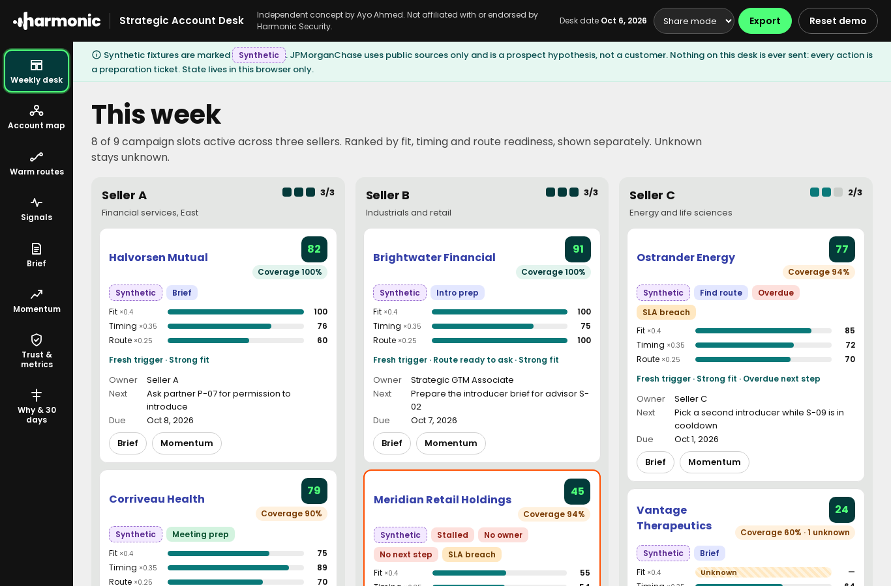

# Strategic Account Desk

**Independent concept by Ayo Ahmed. Not affiliated with or endorsed by Harmonic Security.**

A working desk for the Strategic GTM Associate role at Harmonic Security: the person who helps three strategic sellers win Fortune 100/250 accounts through warm routes, executive moments and sourced signals, not cold sequences. It is not a CRM, a lead scraper or an SDR sequencer. It sends nothing.



## What it does

| View | What you see |
| --- | --- |
| **Weekly desk** | Three seller lanes, 8 of 9 slots active, campaigns ranked by separate fit, timing and route scores with visible weights; Unknown stays Unknown; overdue, no-owner, no-next-step and SLA flags; a parked campaign that cannot enter a full lane |
| **Account map** | Buying committee (CISO, AI/platform, data governance, procurement/legal, exec sponsor), decides vs influences, coverage and unknown seats; evidence ledger with source, date, confidence and provenance |
| **Warm routes** | Verified relationship, public affiliation only, hypothesis, synthetic demo. An intro request is blocked until the relationship, the introducer's permission and the recipient are all verified, and the introducer wasn't asked in the last 30 days |
| **Signals** | Leadership, AI initiative, regulatory, event and news signals with source date, relevance and shelf life; stale, unsourced and duplicate signals are refused as triggers |
| **Five-sentence brief** | Exactly five editable sentences: situation, sourced trigger, stakeholder hypothesis, route with uncertainty, next action with owner and date. Blocked with listed gaps when evidence is missing, stale or overclaimed |
| **Momentum** | Stage state machine, failure reasons, a stalled campaign you can fix, event and introducer preparation tickets, local reminders, capacity board |
| **Trust & metrics** | Eight live tests that try to break the desk's rules, and measures with numerators, denominators and windows. Meetings and pipeline are marked Not measured |
| **Why & 30 days** | 30-second explanation and a first-30-days plan |

## Walkthrough

A 2:17 vertical walkthrough of the real UI with captions: [`docs/video/strategic-account-desk-walkthrough.mp4`](docs/video/strategic-account-desk-walkthrough.mp4) ([transcript](docs/video/TRANSCRIPT.md)).

## Data

- **JPMorganChase** is the one real account, built only from its own public pages (read 2026-10-06). It is a **prospect hypothesis**: not a Harmonic customer and not a confirmed target.
- The other eight accounts are **synthetic** and marked as such on every screen and in every export.
- State lives in your browser (localStorage). **Reset demo** restores the seed. **Share mode** exports strip internal route notes and uncertain names.

## Run it

```bash
npm ci
npm run dev        # http://localhost:5173
npm run typecheck && npm run lint && npm test && npm run build
npx playwright install chromium && npm run e2e
```

Hash routes (`#/desk`, `#/brief/c-jpmc`) work on any static host. `.github/workflows/pages.yml` deploys to GitHub Pages when run manually.

## Docs

[PRD](docs/PRD.md) · [ELI5](docs/ELI5.md) · [30 seconds](docs/THIRTY_SECONDS.md) · [Five whys](docs/FIVE_WHYS.md) · [JTBD](docs/JTBD.md) · [Personas](docs/PERSONAS.md) · [Service blueprint](docs/SERVICE_BLUEPRINT.md) · [Role fit memo](docs/ROLE_FIT_MEMO.md) · [User stories](docs/USER_STORIES.md) · [Acceptance tests](docs/ACCEPTANCE_TESTS.md) · [Data dictionary](docs/DATA_DICTIONARY.md) · [Scoring rubric](docs/SCORING_RUBRIC.md) · [State machines](docs/STATE_MACHINES.md) · [Metrics](docs/METRICS.md) · [Experiment plan](docs/EXPERIMENT_PLAN.md) · [Architecture](docs/ARCHITECTURE.md) · [Risks and limits](docs/RISKS_LIMITS.md) · [Synthetic data and privacy](docs/SYNTHETIC_DATA_PRIVACY.md) · [Test plan](docs/TEST_PLAN.md) · [Test results](docs/TEST_RESULTS.md) · [Rollout](docs/ROLLOUT.md) · [V2 roadmap](docs/V2_ROADMAP.md) · [Research ledger](docs/RESEARCH_LEDGER.md) · [First 30 days](docs/FIRST_30_DAYS.md) · [Brand sheet](docs/BRAND_SHEET.md) · [Design scrape](docs/DESIGN_SCRAPE.md) · [Visual brand guide](docs/design/brand-guide.html)

## Credits and licences

Concept, product and code by Ayo Ahmed. The Harmonic name and logo are Harmonic Security's and are used only to show the intended context. Poppins is under the SIL Open Font License (`src/fonts/OFL-Poppins.txt`). Reference screenshots in `docs/design/reference/` are of Harmonic Security's public pages.
